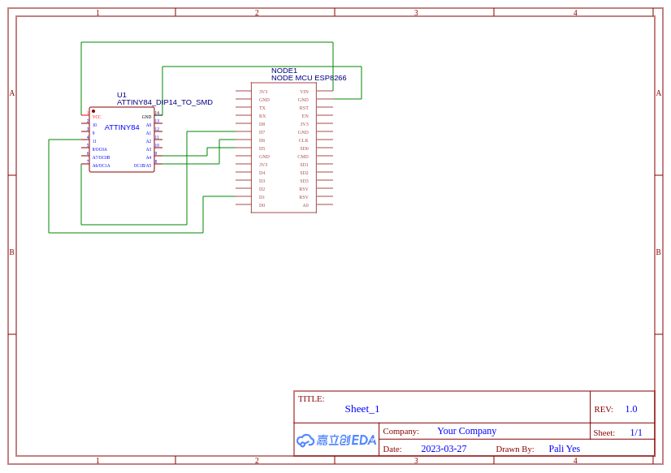

# avr-playground

Programming AVR (atttiny84) with NodeMCU ESP8266 as programmer

## Configure NodeMCU as AVR programmer over wifi

1. Upload `nodemcu/Arduino_Wifi_AVRISP.ino` to the nodemcu via Arduino studio
2. Reboot
3. Wire the chip e.g. in this case ATTimy84 20V


## Compiling and uploading

see makefile for config details in examples

``` make hex ```
to build hex file

to upload
``` make writeflash```